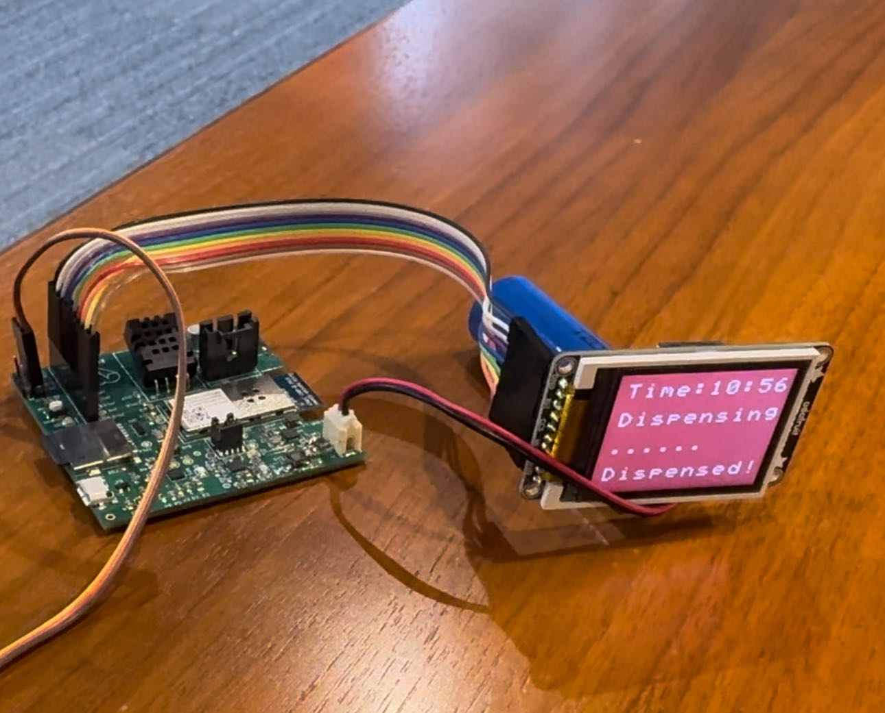
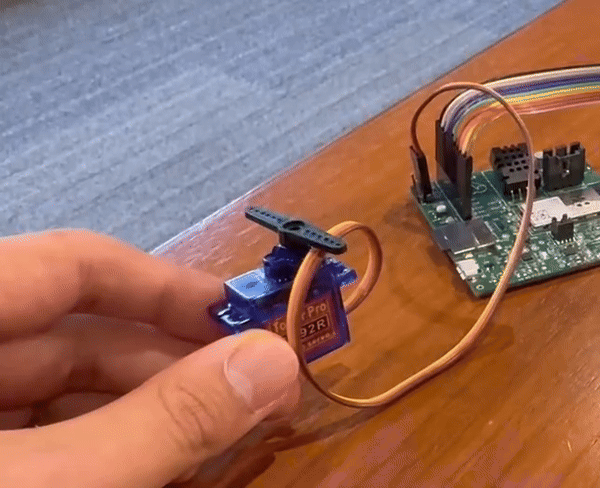
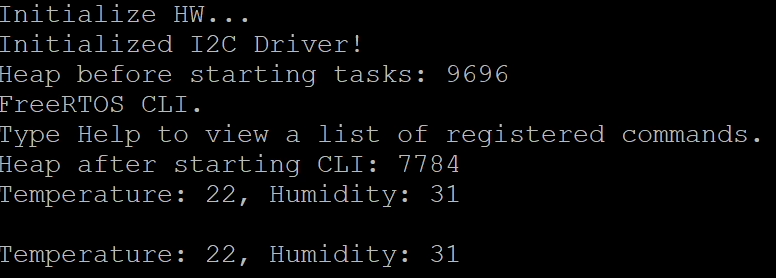
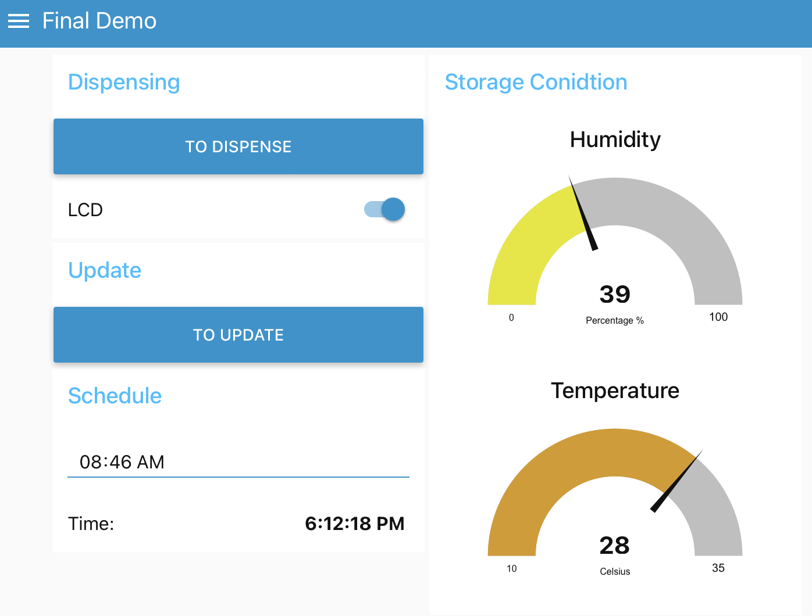
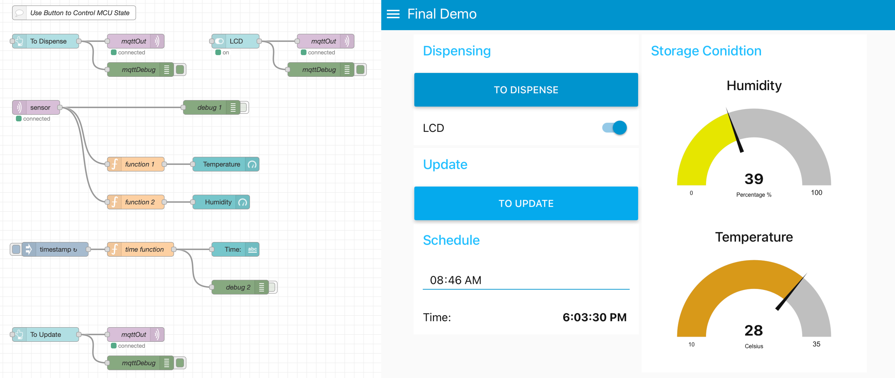
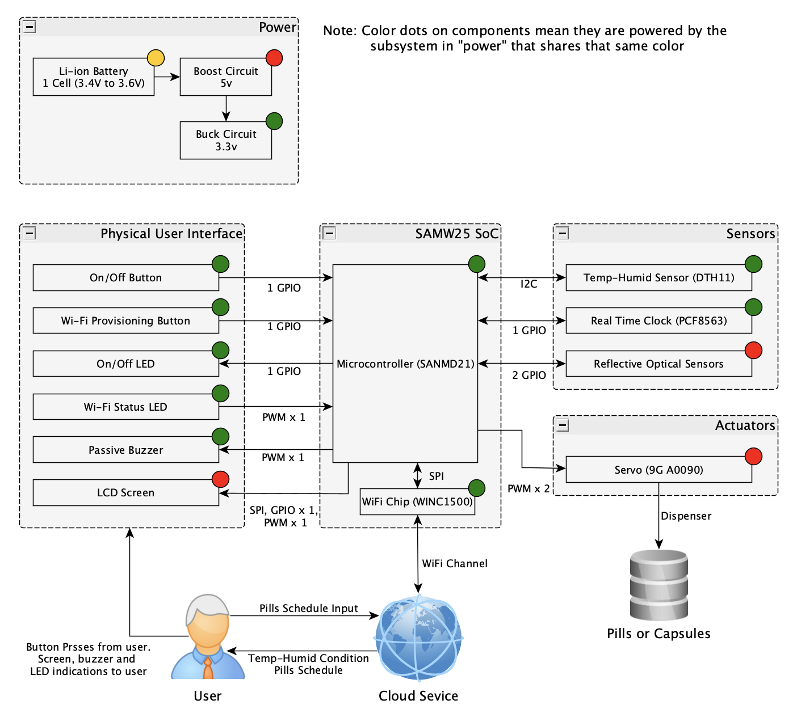

# a14g-final-submission

    * Team Number: 11
    * Team Name: iHealth
    * Team Members: Zed Liu, Jiazhen Zhang
    * Github Repository URL:
    * Description of test hardware: laptop, Project Prototype

## 1. Video Presentation

Please check this [link](https://drive.google.com/file/d/1DVOrOgsghanE2W0uzx0UAIseG3z_vw1k/view?usp=share_link)

## 2. Project Summary

### Device Description

The iHealth smart dispenser addresses the problem of managing complex medication regimens, which can often be challenging and error-prone for individuals who have to take multiple medications at various times throughout the day. It simplifies this process by automatically sorting and dispensing the correct dose of pills at the scheduled times, thereby reducing the risk of missed or incorrect doses.

### Inspiration

The inspiration for the iHealth smart dispenser came from my own experiences watching close family members struggle with managing their complex medication schedules. Seeing them juggle numerous pill bottles and often forgetting to take their medicine on time, or taking the wrong doses, made me realize the need for a more foolproof solution. This personal connection drove my passion to develop a technology that not only assists in managing medications efficiently but also provides peace of mind for both users and their families. The idea was to use smart technology to create a device that could handle the intricacies of medication management with precision, ensuring that the right person gets the right dose at the right time, every time. My goal was to blend my skills in technology with a deep-seated desire to make a tangible difference in the lives of those who face daily health management challenges.

### Device Functionality

The iHealth smart dispenser is a sophisticated Internet-connected device designed to simplify the management of complex medication regimens. It incorporates a range of sensors, actuators, and critical components, integrated through a meticulously designed 4-layer Printed Circuit Board (PCB). Here’s how each component contributes to the functionality of the device:

#### PCB Design

- **4-Layer PCB**: Designed using Altium Designer to facilitate complex communication needs with a high level of integration and reliability. This structure supports various communication protocols such as SPI, I2C, and UART, essential for connecting the microcontroller with various sensors and actuators.
- **Schematic Design**: The schematic design phase involved meticulous placement of components to ensure efficient communication pathways between the microcontroller and peripherals.
- **PCB Layout**: Strategic placement of components in the layout phase focused on minimizing electronic interference and optimizing signal integrity, crucial for reliable operation.

#### Sensors and Actuators

- **Dispensing Mechanism**: Actuators control the mechanical parts that sort and dispense medications. These are critical for the precise delivery of the correct dose at the right time.
- **Temperature and Humidity Sensors**: These sensors monitor the storage conditions within the device to ensure that medications are kept at optimal conditions, thus maintaining their efficacy.
- **Weight Sensors**: Used to detect the presence and quantity of pills in the dispenser to alert users when refills are necessary.

#### Connectivity and Control

- **Wi-Fi Module**: Allows the device to connect to the Internet, enabling remote monitoring and control through the iHealth mobile application. This connection is crucial for updating medication schedules, receiving alerts, and accessing usage statistics.
- **Microcontroller**: The heart of the device, programmed to handle the logic of medication dispensing schedules, sensor data processing, and actuator control.

#### Firmware & Operating System

- **Custom C Drivers**: Developed to ensure that the device's hardware is optimally controlled and interfaced with the system's core logic.
- **FreeRTOS**: The use of FreeRTOS as the operating system facilitates efficient task management and synchronization, allowing real-time operations and stability essential for medical devices.

This integrated approach not only ensures the functional reliability of the iHealth smart dispenser but also enhances its user-friendliness and effectiveness in real-world applications. Through careful design, testing, and the use of advanced operating systems, the dispenser becomes a robust solution for medication management.

### Challenges

#### Firmware Development

- **Objective**: Develop custom firmware drivers from scratch and implement interface functions to enhance portability across different hardware platforms.
- **Approaches**:
  - **Custom Drivers**: Developed dedicated drivers for handling specific hardware functionalities, focusing on communication protocols such as I2C and SPI. This involved writing low-level code that directly interfaces with hardware components.
  - **Interface Abstraction**: Implemented interface functions that abstract the hardware details from the core logic of the firmware. This design allows for easier adaptation if the hardware components change or if the system needs to be ported to different platforms.
  - **Protocol Handling**: Special attention was given to the robust implementation of communication protocols, ensuring reliable data transmission and error handling in environments with potential electronic noise and interference.

#### PCB

- **Objective**: Achieve a compact PCB design that adheres to all design rules and maintains proper net relationships in a hierarchical schematic structure.
- **Approaches**:
  - **Compact Design**: Utilized a 4-layer PCB design to achieve compactness while managing heat dissipation and reducing electromagnetic interference.
  - **Hierarchical Schematics**: Structured the PCB schematics hierarchically to ensure clarity and manage complexity, which helped in maintaining clear net relationships and ease of troubleshooting and testing.
  - **Design Rule Compliance**: Rigorously adhered to PCB design rules using Altium Designer’s design rule check (DRC) features to prevent any potential manufacturing and functionality issues.

#### Software Development

- **Objective**: Efficiently utilize FreeRTOS for task management to ensure reliable real-time system performance.
- **Approaches**:
  - **RTOS Configuration**: Carefully configured semaphore handling, task priorities, and stack sizes to prevent priority inversion and stack overflow issues.
  - **Message Queues**: Implemented message queues for inter-task communication, ensuring that tasks receive timely and reliable messages without losing critical data, crucial for tasks like dispensing the correct medication dosage.
  - **Task Management**: Managed task creation and destruction processes meticulously to optimize resource utilization and ensure system stability.

#### IoT and User Interface

- **Objective**: Design a user-friendly interface and a well-structured MQTT topic hierarchy for efficient message handling over IoT.
- **Approaches**:
  - **User Interface Design**: Developed an intuitive user interface that simplifies user interactions, making the device accessible to users with varying levels of technical proficiency, including the elderly.
  - **MQTT Structure**: Designed a structured MQTT topic hierarchy to handle various data types and commands efficiently, ensuring that messages are processed and acknowledged in a secure and reliable manner.

#### Integration and Mechanical Design

- **Objective**: Overcome challenges associated with the integration of complex mechanical structures like gears and racks.
- **Approaches**:
  - **Mechanical Assembly**: Faced challenges with the assembly of intricate mechanical components, such as ensuring precision in the gear and rack mechanism crucial for accurate pill dispensing.
  - **Testing and Adjustments**: Conducted extensive testing to identify and rectify issues in the mechanical assembly, making iterative adjustments to improve reliability and functionality.

This comprehensive approach to addressing each aspect of the project ensured that the iHealth smart dispenser was not only functional but also robust, reliable, and user-friendly, ready for real-world application and capable of significantly improving medication management.

### Prototype Learnings

Building and testing the iHealth smart dispenser prototype provided valuable insights and lessons that are essential for refining the device and planning future projects. Here are some of the key learnings and reflections on what could be done differently in future iterations:

#### Learnings

1. **Importance of Modular Design**: The testing phase highlighted the benefits of having a modular design, especially when it came to isolating faults and making specific component upgrades or replacements. A more modular approach would facilitate easier maintenance and scalability of the system.
2. **Testing Under Real-World Conditions**: Simulating real-world usage scenarios was incredibly beneficial. It helped identify unforeseen issues, such as how users interact with the device and environmental factors affecting device performance. This emphasized the need for comprehensive user testing to capture a wide range of potential issues.
3. **Power Management Efficiency**: Initial tests of the power system revealed inefficiencies and the need for more robust handling of different power sources and conditions. This led to a deeper understanding of power consumption optimization and battery management, crucial for ensuring the device's reliability, especially in a medical setting.
4. **Integrating Advanced Sensing Technologies**: The use of basic sensors for monitoring temperature and humidity proved adequate but showed limitations in predictive analytics regarding medication quality. Incorporating more advanced sensors could provide deeper insights and enhance the device's functionality.
5. **User Interface Simplicity**: Feedback from user interaction tests showed that while the interface was intuitive, there were still challenges for some users, particularly those with limited tech experience or visual impairments. This taught the importance of user-centered design and the need for customizable interface options.

#### Changes for Future Builds

1. **Enhance User Interface Accessibility**: For future iterations, focusing more on accessibility features, such as voice commands, larger touch-friendly interfaces, and high-contrast displays, would make the device more user-friendly for a broader audience, including those with disabilities.
2. **Expand Testing Protocols**: Implementing a more rigorous and varied testing protocol that includes extreme conditions and long-term usage scenarios would help ensure the device’s durability and reliability in all possible environments.
3. **Improve Mechanical Reliability**: Based on the difficulties encountered with the gear and rack mechanism, exploring alternative dispensing technologies that are less prone to mechanical failure would be beneficial. This could include magnetic, vacuum, or robotic handling systems which might offer improved reliability and precision.
4. **Incorporate IoT Security Enhancements**: Given the sensitive nature of medical data, strengthening the security measures for IoT connectivity is crucial. Implementing advanced encryption methods and continuous security updates would protect user data more effectively.
5. **Feedback Loop from Users**: Establishing a continuous feedback loop with actual users would be integral to iterative design improvements. This could be facilitated through beta testing programs or regular user forums to gather and implement user insights more dynamically.

By applying these lessons and considerations for future builds, the development of medical devices like the iHealth smart dispenser can continue to evolve, becoming more effective, user-friendly, and adaptable to the needs of diverse user populations.

### Next Steps

To further develop and enhance the iHealth smart dispenser, several strategic steps can be taken to ensure its success and efficacy. These next steps aim to refine the product, address any outstanding issues, and prepare it for broader deployment. Here’s a structured approach to advancing the project:

1. Advanced Prototyping and Refinement

   - **Iterative Prototyping:** Continue developing prototypes to iteratively address and refine design and functionality issues identified in earlier tests.
   - **Component Upgrades:** Investigate and integrate higher-quality or more advanced components based on the insights gained from prototype testing, particularly in the areas of sensors and actuators.
2. Enhanced User Interface and Accessibility

   - **User-Centric Design Improvements:** Implement design changes based on user feedback to enhance ease of use and accessibility, including voice commands, larger buttons, and more intuitive app interactions.
   - **Multilingual Support:** Expand the device’s user interface to include multiple language options to cater to a diverse user base.
3. Comprehensive Testing

   - **Extended Field Testing:** Conduct extensive field tests under various environmental conditions and with diverse user groups to ensure the device performs reliably in real-world settings.
   - **Regulatory Testing and Compliance:** Ensure the device meets all necessary regulatory requirements for medical devices, which may involve clinical trials or other formal testing processes.
4. Security Enhancements

   - **IoT Security:** Strengthen the IoT components’ security framework, including implementing end-to-end encryption and regular security audits to protect user data and device functionality.
   - **Continuous Monitoring and Updates:** Develop a system for continuous monitoring of device performance and security, with capabilities for remote updates and patches.

### Takeaways from ESE5160

In the context of a course like ESE5160, which presumably focuses on embedded systems engineering, completing the lectures, assignments, and a course-long prototyping project would provide a comprehensive education in both the theory and practical application of embedded systems. Here are some key takeaways you might have gained from such a course:

#### 1. **Understanding of Embedded Systems Architecture**

- **Core Concepts**: Gained a solid foundation in the principles of embedded system architecture, including microcontrollers, sensors, actuators, and interfacing techniques.
- **System Design**: Learned how to design system architecture that efficiently integrates hardware and software components to meet specific functional requirements.

#### 2. **Proficiency in Programming and Software Development**

- **Firmware Development**: Developed skills in writing and debugging firmware for embedded devices, focusing on real-time operating systems like FreeRTOS.
- **Software Integration**: Learned to integrate various software components and ensure they work seamlessly to perform complex tasks.

#### 3. **Hands-On Experience with Hardware**

- **PCB Design**: Acquired practical skills in PCB design, including schematic creation, layout design, and the use of design software like Altium Designer.
- **Hardware Prototyping**: Engaged in hands-on assembly and testing of hardware, understanding the nuances of electronic component behavior and system integration.

#### 4. **Critical Thinking and Problem Solving**

- **Troubleshooting**: Enhanced ability to troubleshoot and solve complex problems that arise during the design, testing, and implementation phases of hardware and software development.
- **Optimization**: Learned techniques for optimizing both hardware performance and software efficiency to meet design specifications and operational requirements.

#### 5. **Project Management and Teamwork**

- **Collaborative Skills**: Developed the ability to work effectively in teams, coordinating with peers to divide tasks and integrate components into a cohesive system.
- **Project Planning and Execution**: Gained experience in planning and executing long-term projects, from conceptualization through design, development, and testing.

### Project Links

#### 1. **Node-Red**

- **Frontend:** [http://40.123.27.90:1880/ui/#!/0?socketid=UhFbEJ5Mor0aO7WgAAB4](http://40.123.27.90:1880/ui/#!/0?socketid=UhFbEJ5Mor0aO7WgAAB4)
- **Backend:** [http://40.123.27.90:1880/#flow/6d05cb858697aefa](http://40.123.27.90:1880/#flow/6d05cb858697aefa)

#### 2. **Software & Firmware**

**Githud:** [https://github.com/ese5160/a12g-firmware-drivers-t11-ihealth.git](https://github.com/ese5160/a12g-firmware-drivers-t11-ihealth.git)

#### 3. **Altium Project**

**Altium 365:** [https://upenn-eselabs.365.altium.com/designs/6F37403C-E6A6-41A7-8A62-82AC7939DF8A](https://upenn-eselabs.365.altium.com/designs/6F37403C-E6A6-41A7-8A62-82AC7939DF8A)

## 3. Hardware & Software Requirements

### Hardware Requirements (HRS) Review

1. **HRS 01 (SAM W25 microcontroller)**: This requirement was met. The SAM W25 was used as the main controller, providing adequate flash memory and SRAM for the application. Testing involved verifying its operation at the specified frequency and Wi-Fi capability through functional tests.
2. **HRS 02 (DHT22 Sensor)**: Met. The sensor performed within the specified temperature and humidity accuracy. Calibration tests were conducted against known humidity and temperature values to validate the accuracy.
3. **HRS 03 (Optical Sensors)**: Did not met. the collector and emitter pins were mistakenly swapped in the schematics.
4. **HRS 04 (RTC Module PCF8563)**: Did not met. We used the integrated RTC module in SAMW25 chip instead.
5. **HRS 05 (LCD Screen)**: Met. The specified LCD screen displayed information correctly and with the required color depth. Screen functionality was tested through display tests of various images and data.

6. **HRS 06 (Micro servo)**: Met. The servo's speed and angle of operation were verified through mechanical tests measuring the time and degree of movement.

7. **HRS 07 (Power Supply Units)**: Partially met. While the buck converter achieved the desired efficiency, the boost converter fell short by approximately 3%. Efficiency testing involved measuring input and output power under different load conditions.

8. **HRS 08 (Passive Buzzer)**: Did not met. The Passive buzzer in ESE vualt has a wrong footpring, leading to integration failures.
9. **HRS 09 (Wi-Fi Controller)**: Met. The WINC1500 supported the specified data rates and demonstrated reliable connectivity over 50 meters in open space tests.
10. **HRS 10 (LED indicators)**: Met. LED indicators functioned within the visible spectrum and maintained low power consumption, tested through power measurement and visual verification.
11. **HRS 11 (On/Off Button)**: Met. The button's durability and reliability were confirmed through a high-cycle endurance test simulating frequent use.

### Software Requirements (SRS) Review

1. **SRS 01 (Temperature-Humidity Sensor Interface)**: Met. The software correctly interfaced with the DHT22 sensor, and data logging accuracy was confirmed through simulated environmental changes.

2. **SRS 02 (GUI Medication Scheduling)**: Met. The GUI allowed for the setting and modification of medication schedules. This functionality was tested remotely and changes were accurately reflected in the microcontroller's operation.

1. **SRS 03 (Notification Alerts)**: Partially met. Since the failure in buzzer integration, when hitting the schedule time, only LCD screen shows warning information. The buzzer won't works.
2. **SRS 04 (Wi-Fi Controller Communication)**: Met. Remote monitoring and configuration changes were successfully implemented and verified through network communication tests.
[Wifi](images/wifi_communication.gif)
1. **SRS 05 (Dispensing Activity Logging)**: Did not met. In the end, we abandon this functionality of storaging schedule in SD card. Instead, we store the schedule in the backend of the server.
2. **SRS 06 (RTC Synchronization)**: Met. The RTC was accurately synchronized with the system, confirmed through cross-verification tests with the system time.
3. **SRS 07 (Emergency Stop Feature)**: Did not met. Instead, we changed the function into controlling the LCD ON/OFF state in the website.
4. **SRS 08 (LED Indicator Management)**: Met. LED responses to system states and alerts were correctly implemented and verified through scenario-based testing.
5.  **SRS 09 (On/Off Button Management)**: Met. The power control mechanism reliably detected button presses, with consistent operation confirmed through repetitive activation and deactivation tests.

## 4. Project Photos & Screenshots

### Prototype

### PCB Photos

### Thermal Camera

### Altium Designer

### Node-Red

### Block Diagram

